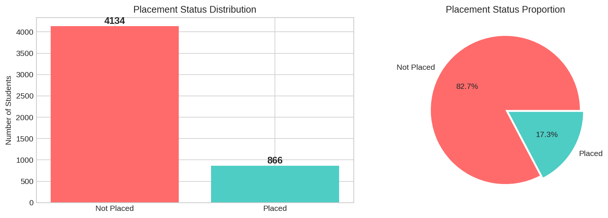
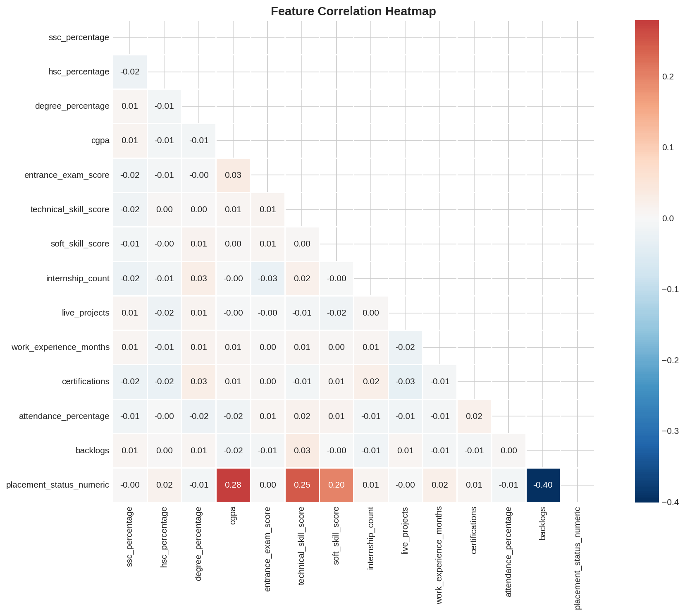
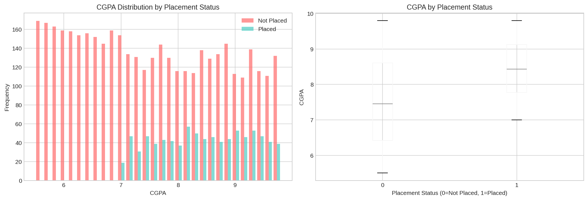
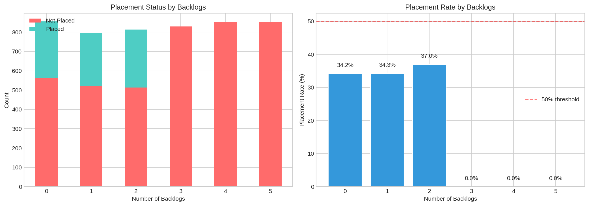
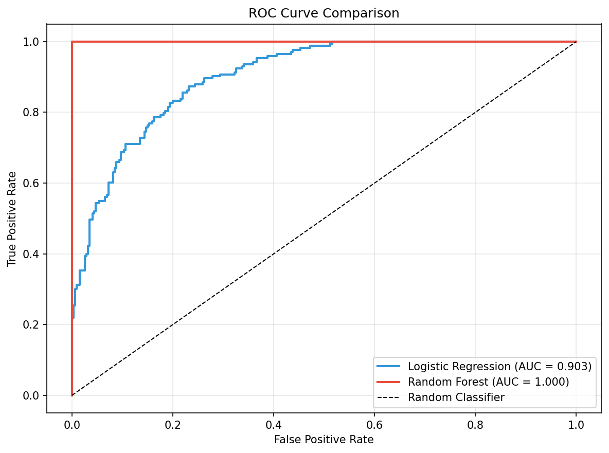
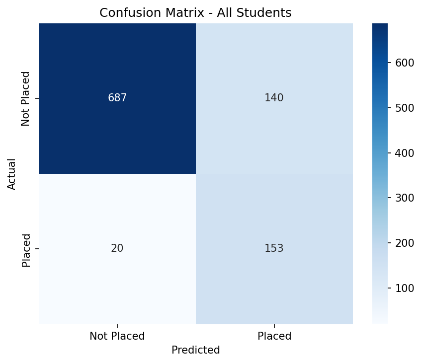
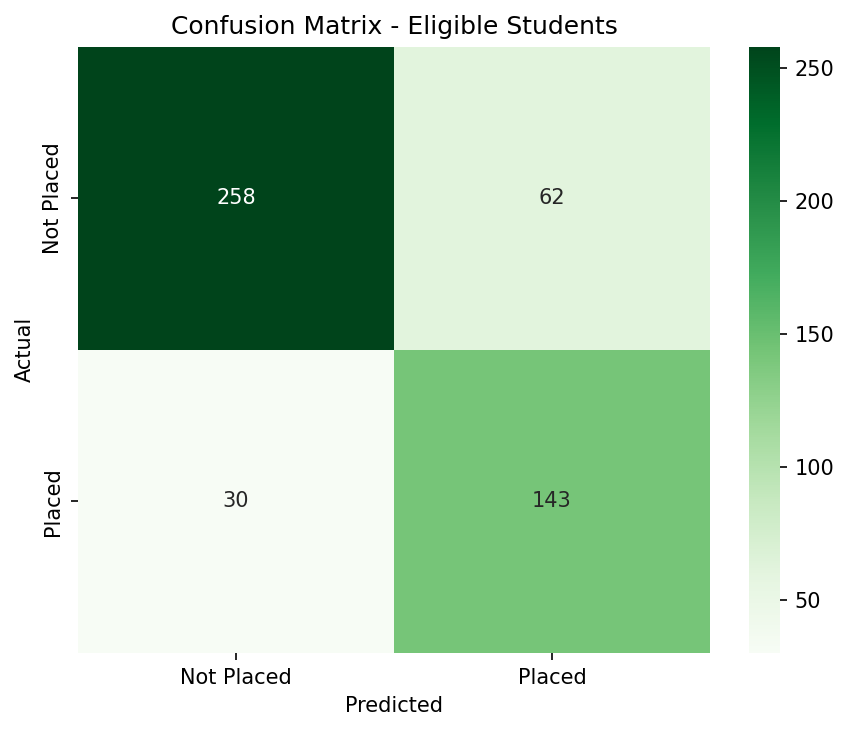

# 🎓 Student Placement Prediction (Machine Learning)

Machine learning project that analyzes student academic performance, skills, experience, and behavioral factors to predict placement outcomes. The project includes exploratory data analysis, feature insights, and predictive modeling using classification algorithms.

---

# 📁 Project Structure

```
placement-prediction/
│
├── data/
│   └── student_placement.csv
│
├── models/
│   └── model.pkl
│
├── notebooks/
│   ├── 01_EDA.ipynb
│   └── 02_Placement_Prediction.ipynb
│
├── plots/
│   ├── academic_distributions.png
│   ├── backlogs_analysis.png
│   ├── backlogs_detailed.png
│   ├── cgpa_analysis.png
│   ├── confusion_matrix_baseline.png
│   ├── confusion_matrix_eligible.png
│   ├── correlation_heatmap.png
│   ├── extracurricular_analysis.png
│   ├── feature_importance.png
│   ├── feature_importance_eligible.png
│   ├── gender_analysis.png
│   ├── model_comparison.png
│   ├── pairplot.png
│   ├── roc_curve.png
│   ├── skill_distributions.png
│   ├── skills_analysis.png
│   ├── target_correlation.png
│   └── target_distribution.png
```

---

# 📊 Exploratory Data Analysis

Notebook: `notebooks/01_EDA.ipynb`

Exploratory analysis was performed to understand the dataset structure, feature distributions, and relationships affecting placement outcomes.

## Dataset

- **5,000 students**
- **18 features**

### Academic Features
- SSC Percentage
- HSC Percentage
- Degree Percentage
- CGPA

### Skills
- Technical Skill Score
- Soft Skill Score
- Entrance Exam Score

### Experience
- Internship Count
- Live Projects
- Work Experience
- Certifications

### Behavioral Factors
- Attendance
- Backlogs
- Extracurricular Activities

### Targets
- Placement Status
- Salary Package

---

# Key Dataset Insights

| Metric | Value |
|------|------|
| Placement Rate | 17.3% |
| Class Imbalance | 4.8 : 1 |
| Missing Values | None |

---

# Most Influential Features

| Rank | Feature | Correlation |
|----|----|----|
| 1 | Backlogs | -0.58 |
| 2 | CGPA | +0.35 |
| 3 | Technical Skills | +0.27 |
| 4 | Soft Skills | +0.16 |

---

## ⚠️ Random Forest Performance Note

The Random Forest model achieves **ROC-AUC = 1.00 and 100% accuracy** on the filtered dataset.  
However, this does **not indicate a perfectly generalizable model**.

During EDA it was discovered that:

**Students with ≥3 backlogs have a 0% placement rate in the dataset.**

This creates a **near-deterministic rule** in the data. Tree-based models like Random Forest can easily exploit this rule by learning a split such as:


---

# Key Visualizations

## Placement Distribution


## Feature Correlation


## CGPA vs Placement


## Backlogs Impact


---

# 🤖 Placement Prediction Model

Notebook: `notebooks/02_Placement_Prediction.ipynb`

This notebook builds machine learning models to predict whether a student will be placed.

---

# Modeling Pipeline

1. Data preprocessing
2. Label encoding for categorical variables
3. Feature scaling using `StandardScaler`
4. Baseline classification model
5. Feature importance analysis
6. Dataset filtering (eligible students)
7. Model comparison

---

# Models Trained

| Dataset | Model | ROC-AUC | F1 Score | Accuracy |
|------|------|------|------|------|
| All Students | Logistic Regression | 0.94 | 0.66 | 0.84 |
| Eligible Students | Logistic Regression | 0.90 | 0.76 | 0.81 |
| Eligible Students | Random Forest | 1.00 | 1.00 | 1.00 |

---

# Most Important Features (Eligible Students)

| Rank | Feature | Impact |
|----|----|----|
| 1 | CGPA | Strong Positive |
| 2 | Technical Skill Score | Strong Positive |
| 3 | Soft Skill Score | Moderate Positive |

---

# Model Evaluation

## ROC Curve


## Confusion Matrix (Baseline)


## Confusion Matrix (Eligible Students)


---

# Saved Model

```
models/model.pkl
```

Includes:
- trained classifier
- feature scaler
- encoders
- metadata

---

# Example Prediction

```python
result = predict_placement({
    'gender': 'Male',
    'ssc_percentage': 75,
    'hsc_percentage': 70,
    'degree_percentage': 72,
    'cgpa': 7.5,
    'entrance_exam_score': 65,
    'technical_skill_score': 70,
    'soft_skill_score': 75,
    'internship_count': 2,
    'live_projects': 3,
    'work_experience_months': 6,
    'certifications': 2,
    'attendance_percentage': 85,
    'backlogs': 1,
    'extracurricular_activities': 'Yes'
})
```

Output

```python
{
 'prediction': 0,
 'prediction_label': 'Not Placed',
 'probability': 0.345
}
```

---

# Tech Stack

- Python
- Pandas
- NumPy
- Scikit-learn
- Matplotlib
- Seaborn
- Jupyter Notebook

---

# Project Goal

Understand the factors affecting student placements and build a machine learning model capable of predicting placement outcomes using academic, skill, and behavioral attributes.
